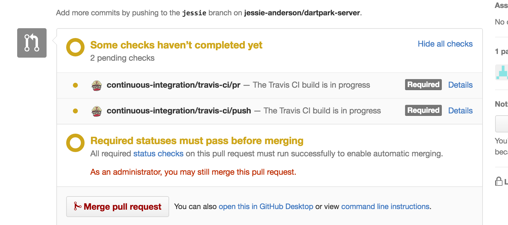

# DartPark server
## Authors: Mau Esquivel, Jessie Anderson, Luisa Vasquez, Ben Cooper, Divya Kalidindi

### The Product!

This is the backend of Dartpark, an app that allows vendors to list parking spots for sale and that allows Dartmouth students to view and buy these spots in one intuitive, easily accessible place. The app utilizes Braintree, a payment API, to let buyers pay for the spots then and there with a credit card. The app also supports messaging between a buyer and the vendor from whom they have bought a spot. The app uses MongoDB to store data and is deployed through Heroku.

### General Information:

**Installation:**
`npm install`

**Deployment:**
Automatically deploys to [Heroku](https://dashboard.heroku.com/apps/dartpark) when the master branch on Github is updated. The continuous integration service Travis CI is used for linting and checking for merge conflicts before pull requests are approved.

Travis CI in progress:

### Database Structure

MongoDB was used for data storage and persistence; [mongoose](https://github.com/Automattic/mongoose) was used on top of MongoDB to create the database structure. The following models were used in the backend to store data:

* Car: used to store information about a renter's car so that vendors would know what cars to expect in particular spots
* Card: would have been used to save renter's cars for future payments, but this has the potential to be implemented more securely through Braintree (the payment API we utilized), so we didn't end up using this model
* Conversation: Models conversations between vendors and renters; implemented as a linked list
* Message: Models a single message within a conversation. A conversation is an array of these messages
* Renter: Models a renter, i.e. a user who buys spots but does not sell them
* Spot: Stores information about a spot, i.e. price, owner, etc.
* Vendor: Models a user who sells (but does not buy) spots

### Other Technologies and Services Used

* [Passport](https://github.com/jaredhanson/passport) for authentication
* [Braintree](https://www.braintreepayments.com/) for payments

### What Did Work

1. Braintree Payment API! This is one of the coolest parts of the project (in my, Jessie's, opinion) because it ACTAULLY allows people to pay using credit cards!
2. Conversations - another really cool part of the app. We implemented web sockets to allow real time updates.

### What Didn't Work: Looking Forward

The following is a list of things that we would add/fix going forward with Dartpark:

1. Nix the "vendor" and "renter" users and instead have a single user model that works for both types of user. We could have refactored our code to make this work for the code submission, but decided that our time was better spent working on other functionality. However, having one user type would simplify several things and make the data/logic flow cleaner.
2. [Google Maps Distance Matrix API](https://developers.google.com/maps/documentation/distance-matrix/intro): To allow a renter looking for spots to sort spots by distance from a particular location that they input when searching
3. Also allow sorting spots by price; we intended to implement this but didn't get to it.
3. User email verification to make sure that users input a valid email when they sign up for Dartpark; don't allow them access until they verify the email
4. Dartmouth WebAuth for renters: only allow Dartmouth students to purchase spots
